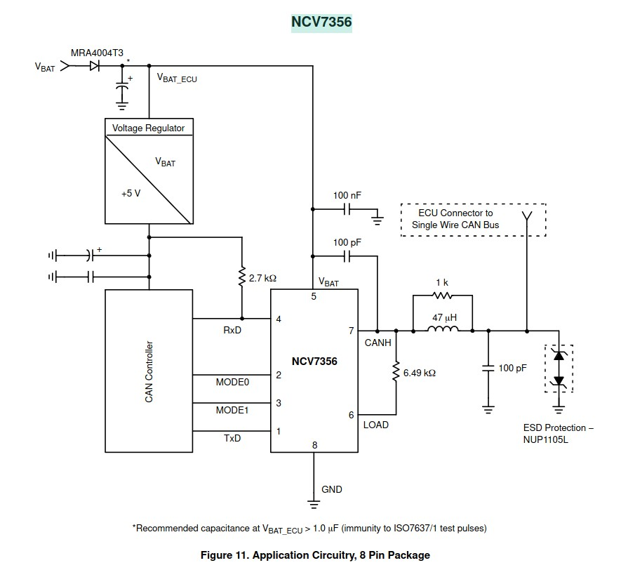

# HomeAuto Network

## Still in Beta, part finished code

This is a slow send/receive network(no master/slave) with collision detection and handling. A bit like CAN but way slower and cut-down and no need for extra hardware.

Collision detection works like 1-wire and CAN with the smallest number having priority and not even knowing there was a collision(So no speed loss), the other unit will switch to reading mode and read the message. It can then try to send the message at a later time.

This is message based like CAN so there is no unit address but rather a message is sent for example for say light switch 7 just switch on. Then maybe the unit responsible for turning on the light will receive the message and turn it on. But there could also be a unit in between that decides what to do and than sends out messages to turn on more lights and/or sends MQTT messages etc.

The idea is for a wired basic and slow network so you do not have to worry to much about end reflection and having different HIGH and LOW states at different points on the line/wire. Being slow should also help with any timing problems and be more tolerant of other stuff like web pages or mqtt hogging the processor and/or interrupts

## hn is short for Home Network here

* Not to be confused with Ethernet. And is for wired networks.
* This will be kind of like a very cut down and slow CAN network. So there will be no need for network hardware.
* Using a bit timing length of 2048µs gives a lines speed of approx 488 bit/s for the bandwidth.
* The number of high or low bits can then be calculated with shift left(11 = div 2048) and bitwise AND, no need for MCU div. Could go 2 or 4 time faster but if the MCU is trying to use onewire etc. at the same time I was thinking the slower the better. Want to keep the timing code as fast as possible as some of it needs to be in an ISR.
* At 488 bit/s and with 1 message taking 20 bits min and 59 max message, tine is approx 24th of a second min and approx one 8th of a second slowest.

### Minimal needed to work for controlling lights with switches and temp

* [x] Send a simple command with 0 or 1 byte of data(with out CRC or handling higher priority incoming messages)
* [x] handle the rest of the data lengths. Tested with 0,1,2 bytes of data.
* [x] Implement crc
* * [x] Each unit on the line will pull the Ack bit low on CRC fail
* * * [ ] This still needs testing.
* [ ] Maximum consecutive bits: On a lower level limit the max consecutive bits of the same value sent to have max time of having the line HIGH and LOW to make the timing more forgiving. Add a inverted bit if 5 bits are at the same level(CAN uses 5) of high or low.

### Current problems

1. [ ] Sending 2 messages without a delay between them messes up the received message
2. [x] TODO check the frame EOF is being sent properly
    1. [ ] After adding the code to make sure we can't have 5 bits in a row of the same value then implement check for line free.
    2. [ ] would also be nice to always be receiving any messages on the line and hence know if the line was free after checking at MCU start.
3. [ ] Line backfeed to the MCU. If there are any unpowered units on the line they will permanently pull the line LOW though the IO pin trying to power the MCU through the IO pin.

    This is because there is a diodes on most MCUs that connects all the IO pins to the power pin.
    * Maybe or at least have the option to use 2 IO pins, 1 with a large resistor to read the line level and another with a transistor to pull the line Low for sending messages. This might also work for level shifting.
    * Or could maybe use an IO buffer but at that point it may be better and cheaper to just use a CAN transceiver chip.

### Planning to add

* [ ] Add an additional Ack bit for units that can handel a message.
* [ ]   Acknowledgment frame bit set for messages that this unit can deal with.
* [ ] Acknowledgment option by sending back the crc checksum.
* [ ] Maybe add some more of the CAN error checking in the 7 bit end frame.
* [ ] At the min if you send messages to fast after each other the reviving part messes up.
* * [ ] TODO: Need to add code to check for line free before sending code. This kind of needs ***"Maximum consecutive bits"*** from [Minimal needed to work](#minimal-needed-to-work-for-controlling-lights-with-switches-and-temp)
* * [ ] TODO: Maybe speed up receiving code and make sure it receives all the message frames so the receiving function don't return while the message ending part of the frame is still being send for example
* * [ ] TODO Add code to try and make sure we don not start receiving a message in the middle of a frame.

### Read bus

* [ ] Read option with ISR on pin change to just store starting time then disable pin interrupts and enable general interrupts and then just call the readMessage() function. This might play badly with other time critical stuff though.
* [ ] Options to have receiving unit(s) use extra wire with interrupt or a week pull-down with 1 controller so the controller can check each time through the main loop.
* [x] Maybe have an option to increase the start pull-down length so it would be long enough that it would stay low for 1 time through the main loop. then you would not need to use interrupts to read. With the ack bit implemented the sender would resend so would not have to catch if doing more than normal in the main loop. Would also need to add 1 high bit at end of SOF (Start of Frame).
* [ ] Implement pin change interrupt line reading.
* [ ] Interrupt to start then continue with timing subsequent pin changes?
* [ ] Alternative first interrupt sets up a timer. Could even use pin change interrupt to correct timing at guaranteed bit change points.
* [ ] TODO: interrupt version, a way to tun off the intercept when doing time sensitive stuff. Will need at least Ack for this.
* [ ] TODO: Some can standards check the level of the pulse 87.5 percent along the pulse length, this gives any reflections/ringing time to settle, see: <http://www.bittiming.can-wiki.info/>

## Can protocol web pages

* <https://www.kvaser.com/can-protocol-tutorial/>
* <https://copperhilltech.com/blog/controller-area-network-can-bus-tutorial-message-frame-format/>

  
Maximum Cable Length

At a speed of 1 MBit/s, a maximum cable length of about 40 meters (130 ft.) can be used. This is because the arbitration scheme requires that the wave front of the signal be able to propagate to the most remote node and back again before the bit is sampled. In other words, the cable length is restricted by the speed of light. A proposal to increase the speed of light has been considered but was turned down because of its inter-galactic consequences.

### Other maximum cable lengths are (these values are approximate)

* 100 meters (330 ft) at 500 kBit/s
* 200 meters (650 ft) at 250 kBit/s
* 500 meters (1600 ft) at 125 kBit/s
* 6 kilometers (20000 ft) at 10 kBit/s

If opto-couplers are used to provide galvanic isolation, the maximum bus length is decreased accordingly. Hint: use fast opto-couplers, and look at the delay through the device, not at the specified maximum bit rate.

## Checking for duplicate Board ID

* [ ] TODO: option to check if anyone else has the same ID 1 time per boot. this would be done the first time the board receives user input i.e. when a switch is used so it is unlikely for any other boards to check at the same time.
* [ ] TODO: single-wire CAN uses a 9.09k ohm pull-up resistor 
  
Single wire CAN bus example from chip data sheet

see https://www.onsemi.com/pdf/datasheet/ncv7356-d.pdf for data sheet.

If we add a resistor to the IO pin to limit the current in case of short to ground(or to v++ if using pull-up) we could then use the voltage on the bus pin to check for unit id duplicating at the time of the first user event.

## Bus line hardware, protection. pull-up values etc

* [ ] TODO: For testing I will use a 220 ohm resistor on the IO pin so any code error will not kill the chips as this should limit the current to 23mA.
* [ ] TODO: for testing the pull-up wil be the MCUs internal pull-up.
* [ ] TODO: The above 2(maybe more) will need to be checked if they create problems with slope speed and voltage check ranges.
* [ ] TODO: Most of the above should be options.
* [ ] TODO: Add a slope shaping circuit something similar to the example from the Onsemi date-sheet above maybe.
* [ ] TODO: Check how robust the internal (20kΩ ??) and 220Ω resistors are.

## Current test circuit

* Line pullup resistor = 1kΩ
* IO pin to line protection resistor = 28Ω
* [ ] TODO: There is a problem with backfeed trying to power the chip through the IO pin when a unit is turn off(unpowered), when using the ATmega328P(and most other chips). This means if one unit is off it pulls the line low all the time.
  * [ ] TODO: Add/Change the code to have the option to use 2 IO pins, 1 to read to line with a high enough resistor in line so it will not pull the line low when the unit is un-powered. And the other pin can be used when sending messages by pulling the line low through and transistor. N-Channel MOSFET or Opto etc.
  * [ ] TODO: While we are at it change the code so it can go high to pull the line low for an NPN transistor etc.
